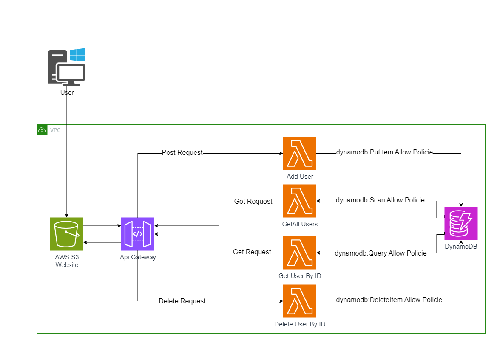

# AWS Lambda - API Gateway - S3 - DynamoDB



---

# Ziel

Unser Ziel ist es, Serverless-Lambda-Funktionen als Backend zu verwenden, DynamoDB als Datenbank zu nutzen, S3 für unsere Website zu hosten und das API-Gateway als Middleware zwischen unserer Website und dem Backend einzusetzen.

- ***Die Website kann derzeit [hier](http://client-management-v1.s3-website.eu-central-1.amazonaws.com) besucht werden***

---

# Steps

### 1. DynamoDB

#### 1.1 Erstelle eine neue Table

- Table name : users
- Partition key  : userId
- Create table

---

### 2. Lambda Functions

#### 2.1 Erstelle eine lambda function

- Function name : add_user
- Runtime : Node.js 18.x
- Create function
- Füge den code in der index.mjs von die lambda function.

```javascript

import { DynamoDBClient, PutItemCommand } from "@aws-sdk/client-dynamodb";


const dynamoDBClient = new DynamoDBClient({ region: "eu-central-1" });
const tableName = "users";

export const handler = async (event) => {
  const { name, email, address,tel } = JSON.parse(event.body);

  
  function generateUniqueUserID() {
  const timestamp = Date.now().toString(36); 
  const randomChars = Math.random().toString(36).substring(2, 8); 
  return timestamp + randomChars;
}
const userId = generateUniqueUserID();

  const params = {
    TableName: tableName,
    Item: {
      "userId": { S: userId },
      "Name": { S: name },
      "Email": { S: email },
      "Address": { S: address },
      "Tel": { S: tel },
    },
  };

  try {
    const command = new PutItemCommand(params);
    await dynamoDBClient.send(command);
    return {
      statusCode: 200,
      body: JSON.stringify({ message: "User added successfully" }),
    };
  } catch (error) {
    return {
      statusCode: 500,
      body: JSON.stringify({ message: "Error adding user", error: error.message }),
    };
  }
};

```

- Unter configuration > Permissions : auf die Role name drücken dann > add permissions > create inline policy > Service : DynamoDB:PutItem Allow

#### 2.2 Erstelle eine zweite lambda function

- Function name : getAll_user
- Runtime : Node.js 18.x
- Create function
- Füge den code in der index.mjs von die lambda function.

```javascript
import { DynamoDBClient, ScanCommand } from "@aws-sdk/client-dynamodb";

const dynamoDBClient = new DynamoDBClient({ region: "eu-central-1" });
const tableName = "users";

export const handler = async (event) => {
  const params = {
    TableName: tableName,
  };

  try {
    const command = new ScanCommand(params);
    const { Items } = await dynamoDBClient.send(command);

    return {
      statusCode: 200,
      body: JSON.stringify(Items),
    };
  } catch (error) {
    return {
      statusCode: 500,
      body: JSON.stringify({ message: "Error fetching users", error: error.message }),
    };
  }
};

```

- Unter configuration > Permissions : auf die Role name drücken dann > add permissions > create inline policy > Service : DynamoDB:Scan Allow

#### 2.3 Erstelle eine Dritte lambda function

- Function name : getById_user
- Runtime : Node.js 18.x
- Create function
- Füge den code  in der index.mjs von die lambda function.

```javascript
import { DynamoDBClient, QueryCommand } from "@aws-sdk/client-dynamodb";

const dynamoDBClient = new DynamoDBClient({ region: "eu-central-1" });
const tableName = "users";

export const handler = async (event) => {
  const name = event.pathParameters.name; 

  const params = {
  TableName: tableName,
  IndexName: "NameIndex",
  KeyConditionExpression: "#name = :name",
  ExpressionAttributeNames: {
    "#name": "Name",
  },
  ExpressionAttributeValues: {
    ":name": { S: name },
  },
};


  try {
    const command = new QueryCommand(params);
    const { Items } = await dynamoDBClient.send(command);

    if (Items) {
      return {
        statusCode: 200,
        body: JSON.stringify(Items),
      };
    } else {
      return {
        statusCode: 404,
        body: JSON.stringify({ message: "User not found" }),
      };
    }
  } catch (error) {
    return {
      statusCode: 500,
      body: JSON.stringify({ message: "Error fetching user", error: error.message }),
    };
  }
};

```

- Unter configuration > Permissions : auf die Role name drücken dann > add permissions > create inline policy > Service : DynamoDB:Query Allow

#### 2.4 Erstelle eine vierte lambda function

- Function name : delete_user
- Runtime : Node.js 18.x
- Create function
- Füge den code in der index.mjs von die lambda function.

```javascript
import { DynamoDBClient, DeleteItemCommand } from "@aws-sdk/client-dynamodb";

const dynamoDBClient = new DynamoDBClient({ region: "eu-central-1" });
const tableName = "users";

export const handler = async (event) => {
  const userId = event.pathParameters.userId;

  const params = {
    TableName: tableName,
    Key: {
      "userId": { S: userId },
    },
  };

  try {
    const command = new DeleteItemCommand(params);
    await dynamoDBClient.send(command);

    return {
      statusCode: 200,
      body: JSON.stringify({ message: "User deleted successfully" }),
    };
  } catch (error) {
    return {
      statusCode: 500,
      body: JSON.stringify({ message: "Error deleting user", error: error.message }),
    };
  }
};
```

- Unter configuration > Permissions : auf die Role name drücken dann > add permissions > create inline policy > Service : DynamoDB:DeleteItem Allow

---

### 3. Api Gateway

#### Erstelle eine Api gateway

- Create Api
- HTTP API Build
- add integration : Lambda > Add die 4 Lambda function
- API name : user_Api
- Next
- add route :

```javascript
 Method : Get
 Resource path :/getall
 Integration target : getAll_user

 Method : Get
 Resource path :/getbyid/{userId}
 Integration target : getById_user

 Method : post
 Resource path :/add
 Integration target : add_user

 Method : delete
 Resource path :/delete/{userId}
 Integration target : delete_user
```

- Next
- Next
- Create
  
---

### 4. S3

#### Erstelle eine S3 Bucket

- ändern in usermanader > src > app > Services > user.service.ts : url = DEINE API_Gateway_Endpoint
- cd usermanager
- ng build
- upload die daten unter dist/usermanager in deine S3 Bucket
- unter properties > Static website hosting > Enable
- unter Permissions > Block public access > Off
- unter Permissions > Bucket policy

```javascript
 {
    "Version": "2012-10-17",
    "Statement": [
        {
            "Sid": "Statement1",
            "Effect": "Allow",
            "Principal": "*",
            "Action": "s3:GetObject",
            "Resource": "arn:aws:s3:::Bucketname/*"
        }
    ]
}
```

# Ende

### Happy Hacking :)
